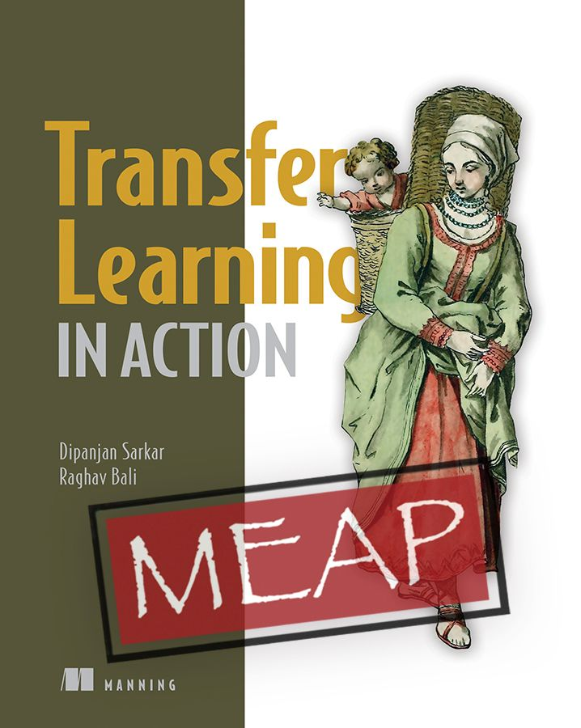

# Transfer Learning in Action
> Use pre-trained models to rapidly transfer existing knowledge and insight for more efficient machine learning applications, even when you have limited or weak datasets.
>> Published by Manning Publications by [Dipanjan Sarkar](https://www.linkedin.com/in/dipanzan/) and [Raghav Bali](https://www.linkedin.com/in/baliraghav/)

[*__"Transfer Learning in Action"__*](https://www.manning.com/books/transfer-learning-in-action?utm_source=bali&utm_medium=affiliate&utm_campaign=book_sarkar_transfer_6_18_21&a_aid=bali&a_bid=0ea74335) teaches the fundamental concepts of _transfer learning_ and how you can easily apply them to your projects. It’s filled with insightful illustrations that demystify the latest research and make this cutting-edge technique easily accessible. You’ll start with the basics, gradually building your confidence and understanding until you’re ready to handle advanced techniques. Each chapter explores a different real-world application of transfer learning, such as image classification and style transfer, automatic question answering, and even speech recognition.

In Transfer Learning in Action you will learn:

+ Fundamental concepts of transfer learning
+ Real world applications of transfer learning
+ Improving performance of computer vision models with state-of-the-art pre-trained models
+ Transfer learning for natural language processing
+ Optimizing audio classification and generation
Leveraging TensorFlow-Hub, HuggingFace transformers, and other frameworks

This repository contains all the code, notebooks and examples used in this book. We will also be adding bonus content here from time to time. So keep watching this space!

## Get the book
<table style="width:100%" >
  <tr>
    <td>
      
    </td>
  </tr>
</table>

## About the book

Humans learn new things more easily when they build on existing related knowledge. Transfer learning applies this same principle to machine learning. This technique takes powerful pre-trained models and shares their existing knowledge to help improve new machine learning applications. The result is a massive performance boost to your models, especially when your training data is limited, unbalanced, or poorly annotated.

Transfer Learning in Action shows you how using pre-trained models can massively improve the accuracy and performance of your machine learning projects. Focused on the real-world applications of transfer learning, you’ll explore how to enhance everything from computer vision to natural language processing and beyond. Master hands-on techniques taken from the latest research, and discover how you can customize open source models for your specific needs.

Edition: 1st (MEAP) &emsp; Pages: 400 (estimated) &emsp; Language: English 
Transfer Learning in Action &emsp; Publisher: Manning 
Copyright: Sarkar & Bali &emsp; 
ISBN: 9781617298943 &emsp;

 
 

## [Contents](https://github.com/dipanjanS/transfer-learning-in-action)  
- __Chapter 1: Fundamentals of Transfer Learning__ : [GitHub](https://github.com/dipanjanS/transfer-learning-in-action/tree/master/chapter_1) | [MEAP LiveBook Chapter](https://livebook.manning.com/book/transfer-learning-in-action/chapter-1?origin=product-toc)
- __Chapter 2: Introduction to Transfer Learning for Computer Vision__ : [GitHub](https://github.com/dipanjanS/transfer-learning-in-action/tree/master/chapter_2) | [MEAP LiveBook Chapter](https://livebook.manning.com/book/transfer-learning-in-action/chapter-2?origin=product-toc)
-  __Chapter 3: Advanced Transfer Learning Use-Cases for Computer Vision- Part I__ : [GitHub](hhttps://github.com/dipanjanS/transfer-learning-in-action/tree/master/chapter_3) | [MEAP LiveBook Chapter](https://livebook.manning.com/book/transfer-learning-in-action/chapter-3?origin=product-toc)
-  __Chapter 4: Advanced Transfer Learning Use-Cases for Computer Vision- Part II__ : [GitHub](https://github.com/dipanjanS/transfer-learning-in-action/tree/master/chapter_4) | [MEAP LiveBook Chapter](https://livebook.manning.com/book/transfer-learning-in-action/chapter-4?origin=product-toc)
- Chapter 5: Generative Transfer Learning for Computer Vision
- Chapter 6: Transfer Learning for Audio Classification
- Chapter 7: Advanced Transfer Learning for Speech Recognition
- Chapter 8: Transfer Learning for Text Classification
- Chapter 9: Advanced Transfer learning for Natural Language Processing
- Chapter 10: Multi-modal transfer learning

## What You Will Learn:
+ Implement paired and unpaired style transfer with networks like StyleGAN
+ Use facial landmarks, autoencoders, and pix2pix GAN to create deepfakes
+ Build several text generation pipelines based on LSTMs, BERT, and GPT-2, learning how attention and transformers changed the NLP landscape
+ Compose music using LSTM models, simple generative adversarial networks, and the intricate MuseGAN
+ Train a deep learning agent to move through a simulated physical environment
+ Discover emerging applications of generative AI, such as folding proteins and creating videos from images

 

## Audience
For data scientists experienced with machine learning and deep learning, Python, PyTorch, and TensorFlow.

